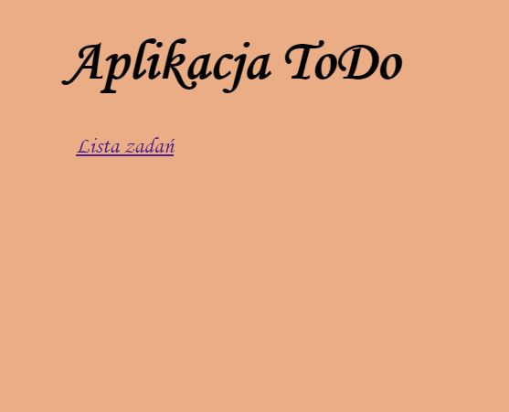
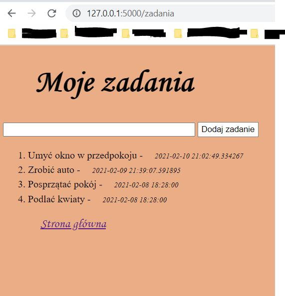
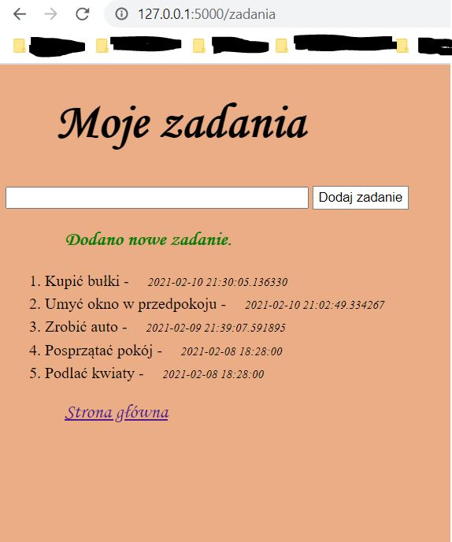
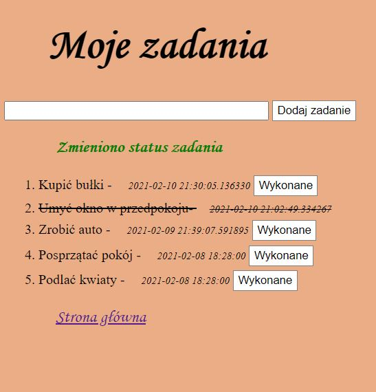

# Simple ToDo application 

### Used technologies:
- SQLite database
- Flask framework
- HTML
- CSS

### Further plan of development contains:
- possibility to log in
- more personalised views in separate tab 'options'

## view of the application:

